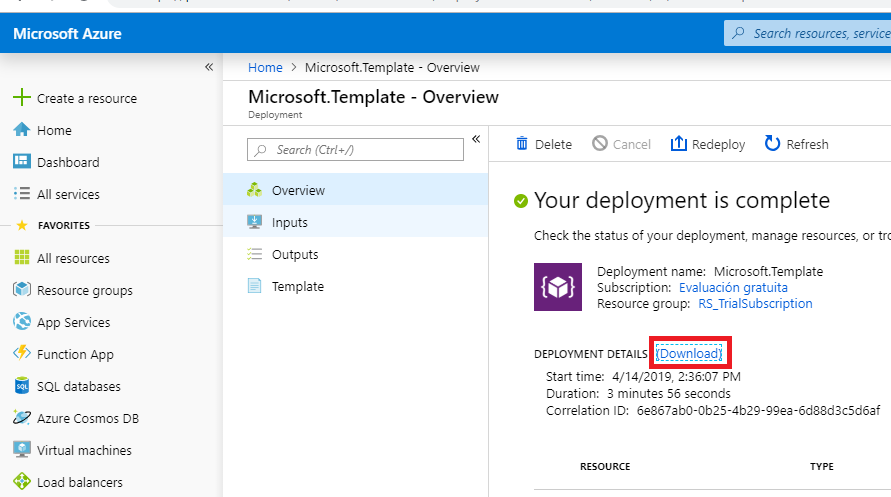
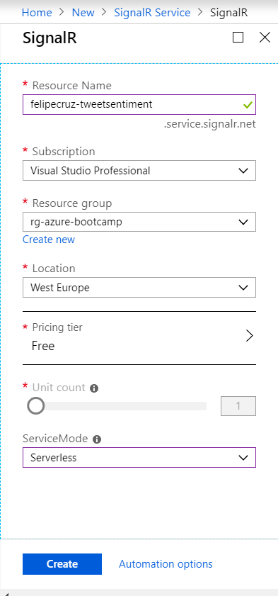

# Tweet Sentiment Analysis 💬➡🧠➡[😊|😐|😥]

## Summary

 *Real-time* tweet sentiment analysis (positive/neutral/negative) and visualization in a .NET Core Web App.
 
 The tweets that are retrieved in *real-time* from the Twitter Stream will be processed and analyzed by the Azure Sentiment Analysis API and persisted in Cosmos DB. 
 Finally, both the tweet text and sentiment will be displayed in the Web App as they come through.

## Index

- [Architecture diagram](#architecture-diagram)
- [Requirements](#requirements)
- [Steps](#steps)

## Architecture diagram

## Requirements

You will need the following tools to complete the hands-on lab.

- Visual Studio 2017
- [Azure Functions Core Tools V2](https://github.com/Azure/azure-functions-core-tools#windows)
- Docker
- Azure account
- Twitter App. If you don't have one, create one [here](https://developer.twitter.com/en/apps).

## Deploy the infrastructure to Azure

You will be deploying the following resources to Azure using an already defined [ARM template](./arm-template/azuredeploy.json):

- Container registry
- Azure Cosmos DB
- Application Insights
- Function App (Consumption plan)
- Storage Account
- SignalR Service
- Cognitive Services (Sentiment Analysis)

The following [README](./arm-template/README.md) will guide you through the instructions to deploy all the resources aforementioned.

> **Important**: Before deploying the infrastructure, make sure you set your own resource names in the [parameters file](./arm-template/azuredeploy.parameters.json).

If you have chosen to deploy the resources using the Azure PowerShell module you can easily get the connection strings and keys from the PowerShell window; otherwise, you can download all the info from a zip file with the  a zip file with "deployment.json" and  "deployment_operations.json"

Next step is to update the file with your keys:

    {
        "TextAnalytics": {
            "Name": "<your-cognitive-service-resource-name>",
            "Key1": "<cognitivekeys-key1>",
            "Key2": "<cognitivekeys-key2>"
        },
        "CosmosDB": {
            "EndpointUrl": "<cosmosDbEndpoint>",
            "AuthorizationKey": "<cosmosDbPrimaryKey>"
        }
    }

Once you have done that, make sure you rename the `appsettings.sample.json` file to `appsettings.json`.

## Build and push the `TweetSentimentAnalysis.Processor` with Docker

The `TweetSentimentAnalysis.Processor` is a .NET Core App 2.2 that listens to the Twitter Stream for tweets given a `keyword` - you must set it in the `appsettings.json` file or pass it as an environment variable when you *run* the docker image.

### Login to your Azure Container Registry

    λ docker login <your-docker-registry> -u <your-user> -p <your-password>

    Example:
    λ docker login acrfcz.azurecr.io -u myuser -p 1234

    WARNING! Using --password via the CLI is insecure. Use --password-stdin.
    Login Succeeded

### Build and publish the docker image

    λ build-and-push.cmd <your-docker-registry> <docker-img-version>

    Example:
    λ build-and-push.cmd acrfcz.azurecr.io 0.1.0

### Run the docker image (locally)

    λ docker run -it --rm -e "Keyword=I love coding" twitterfeedprocessor

    [04/12/2019 16:15:12] - Starting program...
    [04/12/2019 16:15:12] - Environment:
    [04/12/2019 16:15:12] - Starting listening for tweets that contains the keyword 'I love coding'...

or... 

### Run the docker image (as an Azure Container Instance)

## Infrastructure setup

1. Create a resource group with name `rg-azure-bootcamp`

    

2. Create an Azure Cosmos DB Account under the `rg-azure-bootcamp` resource group that you have created in the previous step.

    

        Resource Group  rg-azure-bootcamp
        Location        West Europe
        Account Name    (new) felipecruz-cosmosdb
        API             Core (SQL)
        Geo-Redundancy  Disable
        Multi-region Writes Disable

3. Create both a new database and a new collection under the Cosmos DB account you created in the previous step.

    

        Database Id     TweetAnalysis
        Collection Id   TweetSentiment
        Partition Key   /partitionKey
        Throughput      400

4. ⚡ Create a Function App that will be used to create the Cosmos Trigger Function afterwards. Make sure you select to create an App Insights resource as part of the creation of the Function App.

    

    

    Once that the Function App gets created, navigate to `Function App Settings > API > CORS` and check `Enable Access-Control-Allow-Credentials`. 
    
5. Create an Azure SignalR Service instance. More information [here](https://docs.microsoft.com/en-us/azure/azure-signalr/signalr-quickstart-azure-functions-csharp).

    